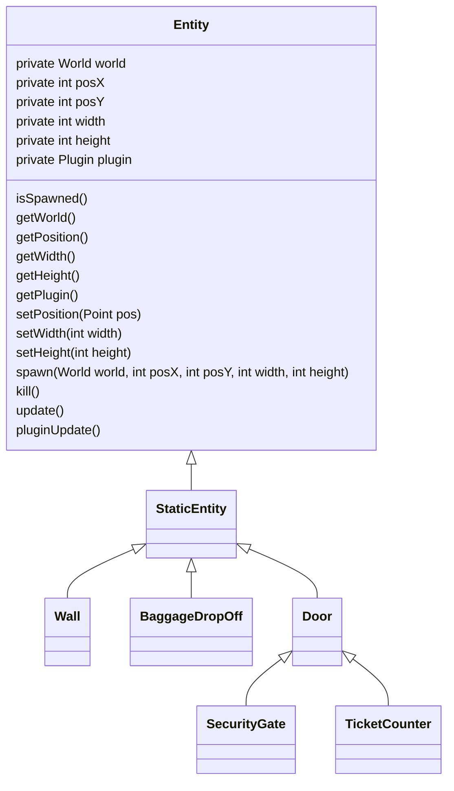

# AirportAgent-Objekte <!-- omit in toc -->
Dies ist das Repo der Objekt-Gruppe des Airport Simulation Projekts :airplane: 

---
# Inhaltsverzeichnis <!-- omit in toc -->
- [Projekt-Oragnisation](#projekt-oragnisation)
  - [Rolleneinteilung](#rolleneinteilung)
- [Software Dokumentation](#software-dokumentation)
  - [Architekturmuster](#architekturmuster)
  - [Strukturentwurfsmuster](#strukturentwurfsmuster)
  - [Objekt-Klassen](#objekt-klassen)
    - [Wände](#wände)
    - [Ticketschalter](#ticketschalter)
    - [Sicherheitsschleuse](#sicherheitsschleuse)
    - [Gepächabgabe](#gepächabgabe)

---
# Projekt-Oragnisation
Das gesamte Product-Backlog mit den dazugehörigen Epics, User-Stories und Sprints der Objekt-Gruppe befindet sich in [JIRA](https://airportagent-objekte.atlassian.net/jira/software/projects/AO/boards/1). 
## Rolleneinteilung
**Ansprechpersonen**:
- Simulationsgruppe
- Agentengruppe
- Dozent
  
**Präsentation**:
- Vorgehen
- Ergebnisse

**Programmieren**:
- Plugin
- Objekte:
  - Wände
  - Ticketschalter
  - Sicherheitsschleuse
  - Gepächabgabe

---
# Software Dokumentation
Unsere Lösung basiert auf einem Java Projekt welches als Plugin in der Architektur der [Simulations-Gruppe](https://github.com/Vincent200355/AirportAgentSimulation-Base) ausgeführt werden kann. Das entsprechende Plugin implementiert demnach die benötigte Schnittstelle `dhbw.sose2022.softwareengineering.airportagentsim.simulation.api.plugin.Plugin`.  
Aufgrund der [User Stories](https://airportagent-objekte.atlassian.net/jira/software/projects/AO/boards/1) wurden folgende Objekte implementiert:  
1. Wände
   - für Agenten undurchlässig
   - unterschiedliche Länge und Breite
2. Ticketschalter
   - kontrolliert ob Ticket vorhanden
3. Sicherheitsschleuse
   - kontrolliert ob Gepäck vorhanden
4. Gepächabgabe
   - Agenten können Gepäck abgeben

## Architekturmuster
Die Simulationsumgebung an sich verwendet die Plug-In Architektur.

Demnach stellt die Simulationsgruppe die Schnittstelle `dhbw.sose2022.softwareengineering.airportagentsim.simulation.api.plugin.Plugin` zur Verfügung die von uns implementiert wurde, sodass unser `ObjectPlugin` in das Gesamtsystem implementiert werden kann. 
## Strukturentwurfsmuster

## Objekt-Klassen
Für jedes oben genannte Objekte wurde eine eigene Klasse im `entities` folder angelegt. Diese erben alle von der Klasse `StaticEntity`, die Kind-Klasse von `Entity` ist. 

### Wände
### Ticketschalter
### Sicherheitsschleuse
### Gepächabgabe